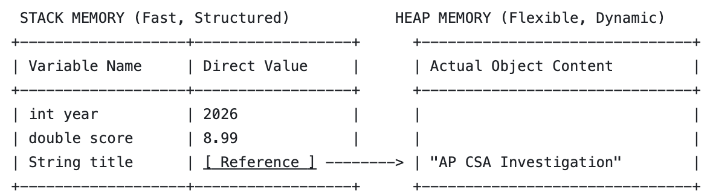
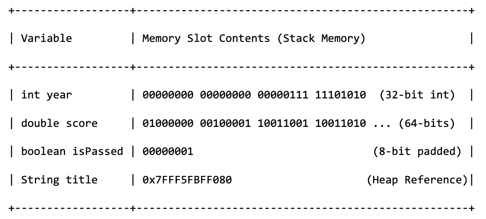

# 1.16 Variables and Data Types

**CED Topics:** 1.2

This is review — you've been declaring variables since CS1. This page is a fast, precise recap, not a first introduction. (For what's actually happening in memory when you create one, and how reference types like objects behave differently from primitives, see [1.19 Printing Objects](notes_19_printing_objects.md) — that's the deep dive; this page stays at the surface, on purpose.)

---

## 1. The Primitive Types You Need

| Type | Holds | Example |
|---|---|---|
| `int` | whole numbers | `int year = 2010;` |
| `double` | decimal numbers | `double score = 8.8;` |
| `boolean` | `true` or `false` | `boolean isReleased = true;` |

`String` isn't on this list — it's a reference type, not a primitive, even though it acts a lot like one day-to-day. See 1.19 for why that distinction matters.

---

## 2. Declaring and Initializing

```java
int year;          // declared — a slot exists, but has no value you can use yet
year = 2010;        // initialized — now it holds 2010

double score = 8.8; // declared and initialized in one line, the usual style
```

A declared-but-uninitialized local variable can't be read — Java won't compile code that tries to use one before it's been given a value.

---

## 3. Naming Rules and Conventions

**Rules (break these and it won't compile):**

- Must start with a letter, `_`, or `$` — never a digit
- Can't be a Java reserved word (`int`, `class`, `return`, etc.)
- Case-sensitive — `score` and `Score` are different variables

**Conventions (legal either way, but expected style, including on the AP exam's own code):**

- Variables and methods: `camelCase` — `movieScore`, not `moviescore` or `movie_score`
- Classes: `PascalCase` — `NetflixMovie`, not `netflixMovie`
- Constants (`final` variables): `ALL_CAPS` — `MAX_SCORE`

---

## 4. Data in Memory

### The Stack and the Heap



- **Primitives** (int, double, boolean): These are local, lightweight variables. Their literal value is stored directly on the Stack. When you pass a primitive to a method, Java copies the raw value.
- **References** (String, arrays, custom objects): These are complex structures. The Stack only holds a 64-bit memory address pointer. The actual data lives in a large, flexible memory pool called the Heap. When you compare two strings or objects using ==, you are comparing their memory addresses on the Stack, not their actual contents on the Heap!

### The Stack in Detail
The stack actually stores data in binary. Each data type is allocated a corresponding size.



### How Integers Are Stored

Each bit position from right to left represents a positive power of 2 (\(2^0, 2^1, 2^2\), etc.).

• The rightmost bit represents \(+2^0 = 1\)
• The second bit represents \(+2^1 = 2\)
• The 31st bit represents \(+2^{30} = 1,073,741,824\)
• The 32nd (leftmost) bit represents \(-2^{31} = -2,147,483,648\)

**Doing the Math**

To find the value of any binary number, you simply add up the weights of all the positions that have a 1.
For your number:
* 32nd bit is 1 \(\rightarrow -2,147,483,648\)
* All other 31 bits are 0 \(\rightarrow 0\)
\(\text{Total\ Value}=-2,147,483,648+0=\mathbf{-2,147,483,648}\)

**How do you actually get 0?**

Because of this math, the only way to get a value of zero in two's complement is if every single bit is zero (0000...0000).

To represent -1, you turn on the massive negative bit and fill the rest with positive bits to pull it back up toward zero:

\(-2,147,483,648+2^{30}+2^{29}+...+2^{0}=-1\)

(Which looks like 11111111 11111111 11111111 11111111 in binary).

---

## Common Errors

| Error | What's actually happening | Fix |
|---|---|---|
| "variable might not have been initialized" | Declared a variable but tried to use it before giving it a value | Initialize before you read it, even to a placeholder value |
| Treating `score` and `Score` as the same variable | Java is case-sensitive | Match capitalization exactly, every time |
| Naming a variable starting with a digit (`2ndScore`) | Illegal identifier — doesn't compile | Start with a letter instead (`secondScore`) |
